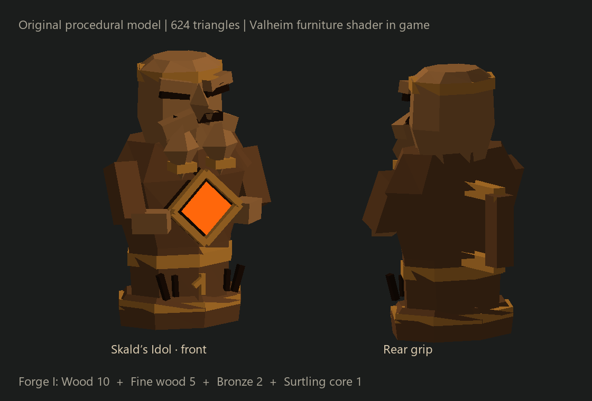
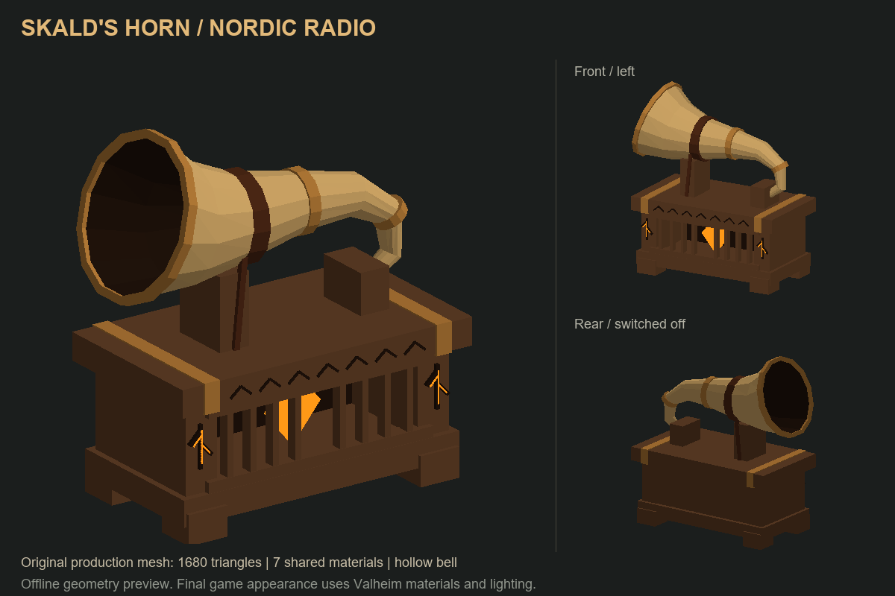

# NordicRadio 1.2.2 — Рог и идол скальда

Строительный рог и переносной идол для совместного прослушивания локальных MP3 хоста. Мод использует BepInEx и Jötunn из этой сборки; одинаковая версия NordicRadio обязательна у хоста и всех игроков. Оба предмета используют одну библиотеку и одно окно управления, но имеют независимое воспроизведение.

## Как пользоваться

1. Обновите сборку у всех участников и перезапустите Valheim.
2. На компьютере хоста положите MP3 непосредственно в `<папка Valheim>/NordicRadio/Music`. Папка создаётся при запуске мода. Имена файлов становятся названиями композиций; подпапки не сканируются.
3. Постройте **«Рог скальда»** молотком, рядом с верстаком. Нужны 20 Fine Wood, 5 бронзы, 4 обрывка кожи и 1 ядро суртлинга. Изучите соответствующие материалы обычным способом, чтобы открыть рецепт.
4. Подойдите к предмету, нажмите **E**, выберите композицию или «Включить». После добавления или изменения файлов хост нажимает **«Обновить»** в окне.
5. «Громкость радио» влияет на всех около этого предмета; «Личная громкость» меняет только ваш звук. Также действуют настройки общей громкости/эффектов игры, поскольку источник подключён к игровому ambient mixer.

В окне есть пауза, предыдущая/следующая композиция, список по шесть строк на страницу, повтор плейлиста и перемешивание. Управлять предметом могут находящиеся рядом игроки. Escape или кнопка B контроллера закрывает окно. Интерфейс использует деревянную панель и шрифты Jötunn, как окно порталов.

Начиная с 1.2.1 пауза сохраняет локальный декодер, пока источник рядом и есть место в лимите восьми источников. Продолжение начинается с сохранённой позиции хоста. При запуске или необходимой перемотке мод сначала беззвучно устанавливает позицию и пропускает буферы декодера, затем плавно возвращает громкость: начало файла не должно кратко проигрываться перед нужным фрагментом. Уход за радиус слышимости, выход из мира или вытеснение играющими источниками освобождают декодер; повторное открытие также проходит эту проверку позиции.

В 1.2.2 повторный выбор того же трека и другие резкие изменения позиции хоста обрабатываются сразу после получения нового состояния. Они больше не ждут очередной двухсекундной проверки расхождения; неверный фрагмент глушится до завершения перемотки.

Плейлист задаёт хост. Остальные компьютеры автоматически получают недостающие файлы и воспроизводят их на текущей позиции. Пока новый файл загружается, звука у получателя нет; в окне показаны процент и средняя скорость загрузки. Уже полученные композиции повторно передавать не нужно.

**Как избежать передачи MP3 через игру:** заранее поместите у каждого игрока копии файлов хоста в `<Valheim>/NordicRadio/Music`. Мод найдёт совпадающий файл по размеру и SHA-256 даже с другим именем, проверит его в фоне и будет воспроизводить прямо из этой папки. В кэш копия не создаётся. Перекодированный или отредактированный MP3 считается другим файлом. Локальные композиции слушателя не добавляются в плейлист хоста. Поиск ограничен 4096 файлами непосредственно в папке, без подпапок и ссылок.

В версии 1.2.0 одновременно запрашиваются четыре блока по 24 КиБ, что уменьшает влияние пинга. У хоста чтение блоков, у слушателя запись и проверка файла выполняются в фоне. Игра передаёт пакеты в основном потоке, а мод приостанавливает музыкальные пакеты при заполнении очереди соединения. Это уменьшает причины подтормаживаний, но музыка всё равно использует тот же интернет и транспорт Valheim; слабое соединение, большие файлы и несколько слушателей могут ограничивать скорость.

Передача начинается при получении состояния играющего рога/идола в радиусе подписки (до 200 м, если предмет/персонаж загружен игрой), ещё до границы слышимости 150 м. Следующий трек по порядку подгружается после текущего; при перемешивании предсказать выбор нельзя. При личной громкости 0 новые запросы не создаются, текущая ненужная загрузка отменяется после истечения короткого интервала запросов. Первый неизвестный файл по-прежнему должен быть получен полностью и пройти проверку: потоковое воспроизведение по мере получения не реализовано.

## Переносной «Идол скальда»

Рецепт в **кузнице первого уровня**: **10 обычной древесины, 5 качественной древесины, 2 бронзы, 1 ядро суртлинга**. Для открытия рецепта изучите все материалы и кузницу. Предмет весит 2, занимает одну ячейку, не складывается в стопку, не изнашивается и не требует улучшений. В строительном меню его нет.

Положите идол на панель быстрого доступа и нажмите номер ячейки либо нажмите на него правой кнопкой в своём инвентаре. Персонаж возьмёт идол, инвентарь закроется и откроется общее окно радио. **Левая кнопка мыши с идолом в руке** повторно открывает управление. Предмет не атакует и не открывает строительство.

Выберите музыку и закройте окно. Можно убрать идол из рук, взять оружие или управлять кораблём — музыка продолжает играть, пока именно этот предмет находится в основном инвентаре владельца. Звук следует за персонажем, включая движение корабля; окружающие игроки слышат его с направлением и затуханием. У переносного идола действуют те же усиление ×1, зона полной громкости 15 м, верхняя граница 150 м, личная громкость и приглушение фоновой музыки, что у рога. Дальность дополнительно ограничена штатной загрузкой персонажа.

Управление переносным идолом доступно его владельцу. Выбрасывание, помещение в сундук/другой отдельный инвентарь, смерть или выход из мира выключают музыку. Новый владелец включает переданный предмет заново. Несколько идолов в сумке не создают несколько источников: у игрока активен последний использованный предмет. При нормальном выходе источник отзывается сразу, при обрыве соединения разрешение хоста истекает максимум за шесть секунд.



Предпросмотр показывает реальную геометрию вне игры: резной деревянный скальд, бронзовые обручи и светящееся ядро. 624 треугольника, пять материалов, высота около 46 см. В игре используются материалы с игровым шейдером; освещение и положение в руке проверяются отдельно.

## Модель и звук

Оригинальная модель создаётся кодом: деревянная резная тумба, изогнутый полый рог, бронзовые обручи, кожаные крепления, ядро и руны. 1680 треугольников в семи общих группах материалов. Материалы используют игровой шейдер; геометрия, текстуры и иконка созданы для этого мода.



Это изображение геометрии вне игры, а не скриншот Valheim. Игровой свет и фактура материалов могут выглядеть иначе.

Звук пространственный: направление зависит от положения слушателя. В сборке 1.13.1 полная громкость действует до **15 м**, затем звук плавно затихает до тишины к **150 м**. Раньше зона полной громкости была всего 2,5 м: уже на 10 м оставалось около 25% уровня источника. Новая настройка расширяет область громкого звучания; непосредственно рядом с предметом максимальный уровень остаётся прежним.

Усиление сигнала — **×1**, без дополнительного сжатия пиков. Изменение затухания не добавляет перегрузку усилителя; качество самого MP3, громкость эффектов игры и одновременное звучание нескольких источников по-прежнему влияют на результат. Стереопозиционирование и сглаживание включения/выключения сохранены. Стены пока не перекрывают музыку. Одновременно декодируются максимум восемь ближайших играющих источников.

Расчётный уровень относительно громкости рядом с источником (до личного/общего ползунков и микшера игры):

| Расстояние | Раньше, NearDistance = 2.5 | Теперь, NearDistance = 15 |
|---|---:|---:|
| 10 м | 25% | 100% |
| 30 м | 8% | 49% |
| 50 м | 4,5% | 28% |
| 100 м | 1,4% | 9% |
| 150 м | 0% | 0% |

Это относительная амплитуда, а не субъективная громкость в процентах. Расстояние считается до активного слушателя игры, который может находиться у камеры. Обновить конфиг нужно у каждого слушателя: эти аудионастройки локальные. Радиус 15 м поддерживался уже в DLL 1.1.2 и сохранён в 1.2.0.

**150 м — верхняя граница звука, а не принудительная дальность загрузки мира.** Рог звучит только пока его модель загружена Valheim; если игра выгрузит предмет раньше, звук прекратится раньше. Мод сохраняет штатную загрузку зон и не удерживает далёкие предметы или базу в памяти. Фактическая дальность поэтому зависит от положения игрока относительно зон и настроек симуляции игры.

Когда рог действительно слышен, стандартная музыка Valheim плавно приглушается **до 20% от вашей обычной настройки**. По мере удаления её громкость возвращается; у границы радиуса влияние исчезает. При выключении рога восстановление занимает примерно 1,6 секунды. Загрузка MP3, личное отключение радио и выключенные звуковые эффекты не удерживают приглушение. Настройка музыки в меню игры не перезаписывается; после выхода из мира или отключения мода исходная громкость восстанавливается.

У каждого рога и каждого активного владельца идола своё состояние воспроизведения и громкость, библиотека общая для мира хоста. Поставленные предметы и предметы инвентаря сохраняются обычными средствами игры; после перезапуска мира воспроизведение выключено. Декодер MP3 работает локально у слушателей, система не захватывает звук рабочего стола хоста.

## Файлы, ограничения и настройки

- Музыка: `<Valheim>/NordicRadio/Music`.
- Кэш получателей: `<Valheim>/NordicRadio/Cache`, до 2 ГиБ с удалением старых неиспользуемых файлов.
- Конфигурация: `BepInEx/config/valheimmodpack.nordicradio.cfg`.
- До 256 уникальных композиций, максимум 64 МиБ на MP3. Требуются обычные файлы MPEG Layer III; повреждённые файлы, неподдерживаемый формат и ссылки пропускаются с записью в журнал.
- Передача блоками по 24 КиБ, проверка длины и SHA-256 до использования файла. При выходе из мира незавершённая загрузка отменяется.
- После загрузки текущего трека заранее запрашивается следующая композиция по порядку. При перемешивании фактически выбранная следующая песня может потребовать отдельной загрузки.
- `Network.UploadKiBPerSecond = 1024` ограничивает общую отдачу музыки хостом примерно до 1 МиБ/с. При задержках игры уменьшите значение, например до 256. Фактическая скорость также зависит от игрового соединения и задержки сети.
- `Network.DownloadWindow = 4` — число одновременно запрошенных блоков у слушателя, диапазон 1–8. Размер каждого — 24 КиБ; память для ожидающих/пришедших блоков ограничена этим окном. Значение 1 возвращает последовательную передачу.
- `Network.MaxQueuedKiB = 96` — порог нативной очереди соединения у хоста, включая уже отправленные, но ещё не подтверждённые данные. Когда добавление следующего блока превысит порог, музыка ждёт освобождения очереди. Диапазон 32–256 КиБ; это не гарантия общей длины очереди, потому что Valheim и другие моды также посылают пакеты. Глобальные настройки транспорта игры не меняются.
- `Audio.PersonalVolume = 0.8` — личная громкость; ползунок в окне сохраняет это значение.
- `Audio.NearDistance = 15`, `FarDistance = 150` — зона полной громкости и верхняя граница слышимости в метрах в этой сборке. Допустимый NearDistance — 0,5–20 м, максимум FarDistance — 150 м. Сетевое получение состояния разрешено до 200 м, управление рогом по-прежнему требует близкого подхода. Дальность загрузки мира не меняется. При установке одной DLL без конфига встроенный NearDistance остаётся 2,5 м.
- `Audio.Amplification = 1` — стандартный уровень без дополнительного усиления и сжатия пиков, одинаковый для рога и идола. Диапазон 1–6; при значениях выше 1 применяется усиление с мягким ограничением пиков до пространственного затухания и громкости эффектов игры.
- `Audio.BackgroundMusicVolume = 0.2` — доля обычной музыки рядом со слышимым рогом. Значение `1` отключает приглушение.
- Настройки рецепта требуют перезапуска и должны совпадать у игроков.

Музыкальная папка расположена вне заменяемой папки BepInEx. Установщики Windows/Linux сохраняют её и включают в полный бэкап корня игры. Музыка и кэш не публикуются вместе со сборкой. При удалении мода сначала разберите рога и удалите идолы из персонажей/сундуков, затем сохранитесь с установленным модом.

## Разработка и проверка

Сборка на Windows с установленной игрой:

```powershell
./plugins/NordicRadio/Build.ps1 -GameDirectory 'C:\Program Files (x86)\Steam\steamapps\common\Valheim'
./plugins/NordicRadio/Test.ps1 -GameDirectory 'C:\Program Files (x86)\Steam\steamapps\common\Valheim'
```

Сборка использует системный компилятор .NET Framework и настоящие библиотеки игры/Jötunn. Игровые библиотеки не включаются в исходники мода. DLL предназначена для Windows и Linux; нативный Linux-клиент отдельно не проверен.

Автоматические проверки охватывают протокол, библиотеку, сетевую службу с тестовыми заменами окружения, расчёт воспроизведения/затухания, форматирование интерфейса и настоящую геометрию модели. Эти проверки не заменяют прослушивание, визуальную проверку размещения и испытание на восьми настоящих клиентах.

Автоматические проверки охватывают протокол и сетевую службу, воспроизведение/затухание, усиление/ограничение пиков, приглушение музыки, интерфейсный текст и 1680 треугольников модели. Сеть проверяется с семью моделируемыми клиентами, включая слушателей на 145–199 м; эти тесты проверяют обмен состоянием, а не загрузку предметов игрой. Изолированный запуск настоящего Valheim проверяет регистрацию модели, Harmony-перехват штатной музыки (20%, сто обновлений без накопления множителя, восстановление), декодирование MP3 и работу режима ×1 в настоящем потоке аудио. Последний тестовый фильтр обнуляет звук перед выводом на колонки. Слуховая проверка пространственного звучания и испытание на восьми настоящих клиентах всё ещё требуются.

В 1.1.0 пройдены 254 автоматические проверки: 93 сетевых, 66 поведения переносного предмета, 27 воспроизведения/затухания, 13 усиления, 27 приглушения музыки и 28 форматирования интерфейса, плюс геометрия обеих моделей. Проверяются движение источника, отзыв/истечение разрешения, запрет чужого управления, передача MP3 слушателям идола, потеря предмета/смерть/передача владельцу и очистка при выходе из мира. Нативная проверка регистрирует идол в настоящем ObjectDB и отдельно вызывает штатную регистрацию рецептов Jotunn (в меню она ещё отложена до загрузки мира), проверяя кузницу, материалы, иконку, отделение модели в руке от физики выброшенного предмета и сохранность обычного молотка. Восемь настоящих клиентов, движение на настоящем корабле и анимация удержания не автоматизированы.

В 1.1.1 дополнительно пройдены 19 аудиопроверок: прозрачность конечных отсчётов при ×1, включая пики, подавление NaN/Infinity, плавный возврат от усиления и повторное включение усилителя. Изолированный запуск Valheim подтвердил обработку потокового MP3 с коэффициентом ×1; тестовый звук заглушён перед колонками.

В 1.1.2 исправлено отложенное открытие окна идола: оно ожидает освобождения чата, консоли, штатного текстового диалога и модального окна другого мода. Escape/B отменяют запрос открытия. Уже открытое радио закрывается при появлении штатного текстового ввода, чата или консоли, освобождая только собственную блокировку. Добавлены шесть проверок поведения переносного предмета (всего 72); полный набор проверок без запуска игры проходит. Нативная проверка именно этого обновления отдельно не проводилась.

Изменения передачи в 1.2.0 проверяются симуляцией семи слушателей, задержкой 300 мс, перестановкой/повторами блоков, перегруженной очередью, готовыми локальными файлами, неправильной контрольной суммой и отменой фоновой записи. Результаты и ограничения измерений: [проверка сборки 1.14.0](../../audit/nordic-radio-transfer-1.14.0.md).

Нативную проверку можно повторить при закрытой игре: `./plugins/NordicRadio/Test-NativeSmoke.ps1 -GameDirectory '<Valheim>' -TestMp3 '<тестовый MP3>'`. Скрипт запускает отдельный BepInEx с временными сохранениями и автоматически закрывает тестовый процесс. Основной конфиг/плагины игры не заменяет; мод может создать свои каталоги `NordicRadio/Music` и `Cache`.

Приёмочная проверка в игре: построить/повернуть/починить/разобрать рог; проиграть MP3 у хоста и гостя; подойти/отойти до 150 м и повернуть камеру, проверить поведение при штатной выгрузке предмета; проверить приглушение/возвращение музыки, изменение её ползунка во время проигрывания, выключение эффектов и личной громкости; проверить паузу/переключение/повтор, поздний вход и сон, выход во время загрузки, повторный вход с кэшем, несколько рогов, файлы с кириллицей, обновление сборки без потери музыки. Ошибки декодирования и сети записываются в `BepInEx/LogOutput.log`.
